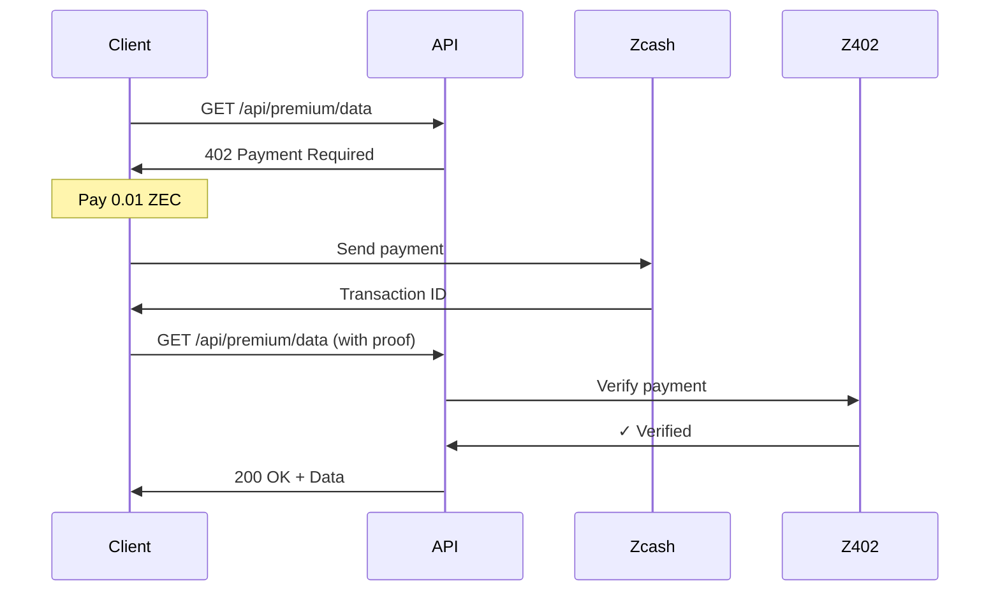

# What is Z402?

Z402 is a payment facilitator built on the x402 protocol, enabling **privacy-preserving micropayments** using Zcash cryptocurrency. It allows developers to monetize APIs, premium content, and digital services with HTTP 402 Payment Required responses.

## The x402 Protocol

The x402 protocol leverages HTTP status code 402 (Payment Required) - a status code reserved since 1997 but rarely used. When a client requests a protected resource:

1. Server responds with `402 Payment Required`
2. Response includes payment details (amount, address)
3. Client makes Zcash payment
4. Client retries request with payment proof
5. Server verifies payment and grants access



## Why Use Z402?

### For API Developers

- **Monetize any endpoint** - Turn any API endpoint into a paid resource
- **No subscriptions** - Pay-per-use model, no monthly billing
- **Automatic verification** - Built-in payment verification and webhooks
- **Privacy-preserving** - Optional shielded transactions with Zcash
- **Developer-friendly** - SDKs for TypeScript, Python, and more

### For API Consumers

- **Pay only for what you use** - No upfront subscriptions
- **Privacy protection** - Shielded addresses keep payments private
- **Micropayments** - Pay as little as $0.0001 per request
- **AI agent friendly** - Perfect for autonomous agents with budget limits

## Key Features

### Privacy-Preserving Payments

Z402 is built on **Zcash**, which offers optional privacy through shielded addresses:

- **Transparent addresses** - Public, like Bitcoin (starts with `t`)
- **Shielded addresses** - Private, encrypted (starts with `zs`)

### Real-Time Verification

Payments are verified automatically:

- **Instant confirmation** for transparent transactions
- **Webhook notifications** when payments settle
- **Built-in retry logic** for network issues

### Budget Management

Perfect for AI agents and automation:

- **Spending limits** - Daily, hourly, per-transaction
- **Transaction tracking** - Full audit trail
- **Cost control** - Prevent runaway spending

## Use Cases

### API Monetization

```typescript
// Protect any endpoint with a payment requirement
app.use('/api/premium', z402Middleware({
  amount: '0.01',
  resource: '/api/premium/data'
}));
```

### Premium Content

Charge for high-quality articles, videos, or downloads without subscriptions.

### AI Agent Services

Let AI agents autonomously pay for API access with budget controls:

```python
class AIAgent:
    def __init__(self):
        self.z402 = Z402Client(
            budget_manager=BudgetManager(daily_limit="1.0")
        )
```

### Research Data Access

Monetize datasets, analytics, or research papers with micropayments.

## How It Works

### 1. Create Payment Intent

```typescript
const intent = await z402.payments.create({
  amount: '0.01',
  resource: '/api/premium/data'
});
// Returns: { id: 'pi_...', zcashAddress: 'zs1...', amount: '0.01' }
```

### 2. User Makes Payment

User sends Zcash to the provided address and gets a transaction ID.

### 3. Verify Payment

```typescript
const verified = await z402.payments.verify(intent.id);
if (verified.status === 'settled') {
  // Grant access to resource
}
```

### 4. Receive Webhook

Get notified when payments are confirmed:

```typescript
{
  "type": "payment.settled",
  "data": {
    "id": "tx_...",
    "amount": "0.01",
    "status": "settled"
  }
}
```

## Next Steps

Ready to get started? Follow our [Quick Start Guide](/docs/getting-started/quick-start) to accept your first payment in 5 minutes.

Or explore:

- [How x402 Works](/docs/getting-started/how-x402-works) - Deep dive into the protocol
- [Why Zcash?](/docs/getting-started/why-zcash) - Privacy benefits explained
- [API Reference](/docs/api-reference) - Complete API documentation
- [SDK Documentation](/docs/sdk) - TypeScript and Python SDKs
