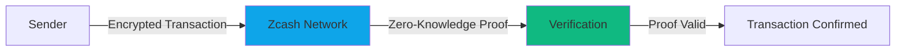

# Why Zcash?

Z402 is built on **Zcash**, a cryptocurrency designed for privacy and security. Here's why Zcash is the perfect foundation for the x402 protocol.

## Privacy-Preserving Payments

Unlike Bitcoin where all transactions are publicly visible on the blockchain, Zcash offers **optional privacy** through shielded addresses.

### Transparent vs Shielded Addresses

Zcash supports two types of addresses:

<Tabs items={['Transparent', 'Shielded']}>
  <Tab value="Transparent">
    **Transparent Addresses** (starts with `t`)

    - Public, like Bitcoin transactions
    - All transaction details visible on blockchain
    - Sender, receiver, and amount are public
    - Faster confirmation times
    - Simpler integration

    ```
    t1abcdef...
    ```

    **When to use:**
    - You don't need privacy
    - Compliance requires transparency
    - Faster confirmation needed
  </Tab>
  <Tab value="Shielded">
    **Shielded Addresses** (starts with `zs`)

    - Private, encrypted transactions
    - Transaction details hidden using zero-knowledge proofs
    - Sender, receiver, and amount are encrypted
    - Slightly slower confirmation
    - Maximum privacy

    ```
    zs1abcdef...
    ```

    **When to use:**
    - Privacy is important
    - Protecting user identity
    - Sensitive transactions
    - Personal payments
  </Tab>
</Tabs>

## Zero-Knowledge Proofs

Zcash uses **zk-SNARKs** (Zero-Knowledge Succinct Non-Interactive Arguments of Knowledge) to enable private transactions.

### How It Works



With zk-SNARKs, the network can verify that:

- ✓ Sender has sufficient funds
- ✓ Transaction is valid
- ✓ Double-spending is prevented

**Without revealing:**

- ✗ Who sent the payment
- ✗ Who received the payment
- ✗ How much was sent

<Callout type="info">
  **Technical Note:** zk-SNARKs allow you to prove you know something (like a secret key) without revealing the actual information.
</Callout>

## Advantages for Z402

### 1. User Privacy

Protect your users' payment history and spending patterns:

```typescript
// User pays for API access without revealing identity
const intent = await z402.payments.create({
  amount: '0.01',
  resource: '/api/sensitive-data',
  // Payment is shielded - no one can link user to this payment
});
```

### 2. Merchant Privacy

Protect your business revenue and customer base:

- Competitors can't see your transaction volume
- Revenue details remain private
- Customer list stays confidential

### 3. Regulatory Flexibility

Choose the right level of privacy for your use case:

- **Transparent** for regulated industries requiring audit trails
- **Shielded** for privacy-sensitive applications
- **Mixed** support both types of addresses

### 4. Future-Proof

Zcash is actively developed with strong privacy guarantees:

- Regular protocol upgrades
- Academic research backing
- Large developer community
- Institutional support

## Privacy Use Cases

### API Monetization

```python
# AI agent pays for data without revealing research direction
client = Z402Client(api_key='...')

# Payment is shielded - competitors can't see what data you're buying
intent = await client.payments.create(
    CreatePaymentIntentParams(
        amount='0.001',
        resource='/api/market-data/AAPL'
    )
)
```

### Content Paywalls

Readers can access premium content without revealing their reading habits.

### Research Data

Researchers can purchase datasets without exposing their research direction to competitors.

### Personal Services

Users can pay for personal services (counseling, health data) with complete privacy.

## Technical Advantages

### Low Fees

Zcash transaction fees are typically very low, making micropayments economical:

- Average fee: ~$0.001 per transaction
- Predictable costs
- No minimum transaction size

### Fast Confirmation

- Block time: ~75 seconds
- 1 confirmation: suitable for low-value transactions
- 6 confirmations: recommended for high-value

### Scalability

Zcash can handle high transaction volumes:

- 2.5-minute block time
- Large block size
- Off-chain scaling solutions in development

### Developer-Friendly

Strong tooling and libraries:

- Multiple RPC implementations
- Well-documented APIs
- Active developer community
- SDKs in many languages

## Privacy Levels

Choose the right privacy level for your application:

| Transaction Type | From | To | Privacy Level | Use Case |
|-----------------|------|-----|---------------|----------|
| Transparent → Transparent | `t` | `t` | None | Public payments, compliance |
| Transparent → Shielded | `t` | `zs` | Medium | Receiving private payments |
| Shielded → Transparent | `zs` | `t` | Medium | Sending from privacy to public |
| Shielded → Shielded | `zs` | `zs` | **Maximum** | Full privacy |

<Callout type="success">
  **Best Practice:** Use shielded addresses whenever privacy is important, transparent when regulatory compliance requires transparency.
</Callout>

## Compliance Considerations

### Selective Disclosure

Zcash supports **viewing keys** that allow selective disclosure:

- Share transaction details with auditors
- Prove compliance without public disclosure
- Maintain privacy while meeting regulatory requirements

### Address Types

Choose address types based on your compliance needs:

```typescript
// Transparent address for compliance
const transparentIntent = await z402.payments.create({
  amount: '0.01',
  resource: '/api/data',
  addressType: 'transparent' // Public, auditable
});

// Shielded address for privacy
const shieldedIntent = await z402.payments.create({
  amount: '0.01',
  resource: '/api/data',
  addressType: 'shielded' // Private, encrypted
});
```

## Comparison with Other Cryptocurrencies

| Feature | Zcash | Bitcoin | Ethereum |
|---------|-------|---------|----------|
| **Privacy** | Optional (shielded) | None | None |
| **Transaction Speed** | ~75 sec | ~10 min | ~15 sec |
| **Fees** | Very Low | High | Variable |
| **Smart Contracts** | Limited | No | Yes |
| **Privacy Tech** | zk-SNARKs | - | - |
| **Best For** | Private payments | Store of value | DApps |

## Getting Started with Privacy

### 1. Enable Shielded Addresses

Configure your Z402 merchant account to use shielded addresses:

```typescript
const z402 = new Z402({
  apiKey: 'z402_live_...',
  preferShielded: true // Use shielded addresses by default
});
```

### 2. Support Both Types

Give users the choice:

```typescript
// Create payment with both address types
const intent = await z402.payments.create({
  amount: '0.01',
  resource: '/api/data',
  // Returns both transparent and shielded addresses
  addressTypes: ['transparent', 'shielded']
});

console.log('Transparent:', intent.zcashAddress);
console.log('Shielded:', intent.zcashShieldedAddress);
```

### 3. Educate Users

Let users know they have privacy options:

```html
<div class="payment-options">
  <h3>Choose Payment Type</h3>

  <button onclick="payTransparent()">
    Public Payment
    <span>Transparent - visible on blockchain</span>
  </button>

  <button onclick="payShielded()">
    Private Payment
    <span>Shielded - encrypted transaction</span>
  </button>
</div>
```

## Learn More

- [Zcash Documentation](https://z.cash/learn/) - Official Zcash docs
- [zk-SNARKs Explained](https://z.cash/technology/zksnarks/) - How zero-knowledge proofs work
- [Privacy Guide](/docs/guides/security) - Security best practices
- [Address Types](/docs/guides/addresses) - Detailed address guide

## Next Steps

Ready to implement privacy-preserving payments?

- [Quick Start](/docs/getting-started/quick-start) - Build your first integration
- [API Reference](/docs/api-reference) - Complete API docs
- [Guides](/docs/guides) - Implementation guides
